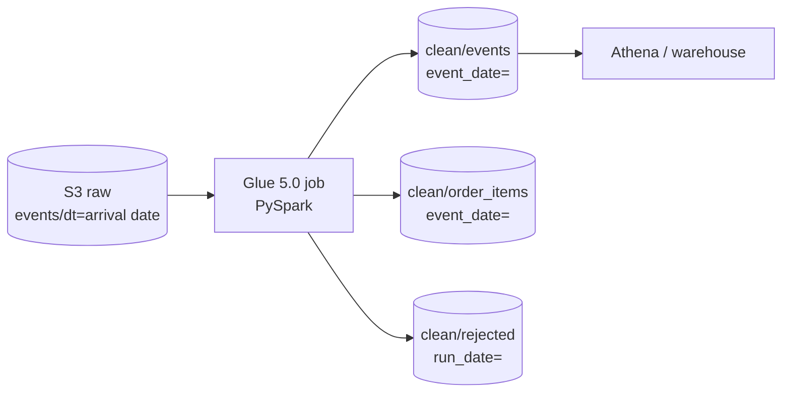

# pyspark-glue-ingestion

A PySpark job on AWS Glue 5.0 that turns the raw event stream into clean Parquet: typed, deduplicated, partitioned by the date the event happened, with bad rows quarantined instead of dropped. Rerunning it for the same day gives the same result.

It is the second piece of a small end-to-end data platform for a fictional online coffee shop. It reads what [events-pipeline-aws-terraform](https://github.com/markotalledo/events-pipeline-aws-terraform) lands in S3.



## Quickstart

Needs Java 17 for local Spark (`brew install openjdk@17` on macOS).

```bash
make setup    # uv sync: Python 3.11 and PySpark 3.5.4, same as Glue 5.0
make test     # 9 tests on a local Spark session, no AWS account needed
make run      # runs the job on the fixture, writes Parquet to data/clean
```

The fixture in `tests/fixtures/raw` is real output of the upstream generator: 1,153 events over three arrival days, with duplicates and late mobile events.

## What the job does

| Step | Why |
|---|---|
| Read with an explicit schema | No inference pass, and a new field upstream cannot silently change a column type |
| Quarantine bad rows with a reason | Corrupt JSON, missing `event_id`, unparseable timestamps go to `rejected/`, counted, not lost |
| Keep the first arrival of each `event_id` | The ingestion layer is at-least-once, so client retries create duplicates |
| Partition by `event_date`, not arrival date | Late events land in the day they happened |
| Explode `order_completed` into `order_items` | One row per order line, ready for revenue models |

## Design decisions

- **Rebuild a window, never append.** Raw data is partitioned by arrival date, so one event date is spread over several arrival partitions. Each run reads arrivals for `[run_date - lookback_days, run_date]` and rewrites only the event dates in that range, using dynamic partition overwrite. Every rewritten date is rebuilt from all of its data, which makes the job idempotent and makes duplicates across days disappear. This holds as long as `lookback_days` covers the maximum arrival lag; the upstream generator caps it at 30 hours and the default is 3 days.
- **Events that arrive inside the window but happened before it are skipped.** Their date is not fully read in this run, so rewriting it would lose data. The run that covers their date picks them up.
- **Filter before deduplicating.** Copies of an event share `occurred_at`, so the result is the same and the shuffle moves fewer rows. The plan and how to read it are in [docs/plan.md](docs/plan.md).
- **One file per date.** Repartitioning by `event_date` before the write avoids one small file per task per date, which every later read would pay for.
- **Local matches Glue.** Python 3.11 and PySpark 3.5.4 are what Glue 5.0 runs, so tests exercise the same engine.
- **Flex execution.** A daily batch without a deadline runs on spare capacity at a lower price per DPU-hour. Switch `execution_class` to `STANDARD` if the job is on a critical path.
- **Least privilege.** The Glue role can read only `events/` in the raw bucket and write only to the clean bucket.

## Cost

Glue bills per DPU-hour, per second, with a one-minute minimum. Two G.1X workers running about 3 minutes a day:

| Execution class | Price per DPU-hour | Per run | Per month (daily) |
|---|---:|---:|---:|
| Flex | $0.29 | ~$0.03 | ~$0.90 |
| Standard | $0.44 | ~$0.04 | ~$1.30 |

Public us-east-1 list prices. Check the AWS pricing page before quoting anyone.

## Deploy

```bash
cp terraform/terraform.tfvars.example terraform/terraform.tfvars   # set raw_bucket_name
make deploy
aws glue start-job-run --job-name $(terraform -chdir=terraform output -raw glue_job_name) \
  --arguments '{"--run_date":"2026-01-03"}'
```

To query from Athena, see [docs/athena.sql](docs/athena.sql): partition projection, no crawler.

## Repo layout

```
src/clean_events/transform.py  the transformations, pure functions over DataFrames
src/clean_events/job.py        argument parsing, Spark session, writes
src/glue_entry.py              the script Glue runs
terraform/                     clean bucket, Glue job, IAM, catalog database
tests/                         unit tests and an end-to-end run on the fixture
```

## License

MIT
